# Práctica Prometheus + Grafana (docker-compose) 

Práctica y documentacón realizada por Javier Soler Cantó como práctica para la asignatura Despliegue de Apliaciones Web.

Introducción a Prometheus y Grafana
===

### Prometheus

Prometheus implementa un gran modelo dimensional de datos que nos permite realizar <cite>querys</cite> muy poderosas para recopilar mucha información. Éstas <cite>querys</cite> nos permiten realizar operaciones sobre ellas, todo esto en tiempo real. <strong>Prometheus</strong> nos permite una fácil implementación con otros sistemas como <strong>Grafana</strong>.

En resumen, nos permite monitorizar y trabajar sobre los resultados de una forma muy potente, fácil y sobretodo con fácil implementación con otros sistemas que puedan trabajar sobre éstos datos.


### Grafana

<strong>Grafana</strong> se ha convertido en la tecnología más popular para crear tableros basándose en metricas de <strong>Prometheus</strong> o <strong>Graphite</strong>. Nos permite crear estos tableros que están compuestos por paneles dónde reside la lógica de las métricas para saber como mostrarse en el layout. Podremos realizar operaciones sobre estás métricas, por ejemplo, para juntar dos resultados de dos métricas distintas. 

En resumen, nos permite visualizar los datos nutriendose de servicios como <strong>Prometheus</strong> y así de una forma muy sencilla encontrar puntos débiles en nuestros endpoints o tener mejor controlado el tráfico de nuestra página web para poder mejorarlo.


Práctica
===

### Aplicación 

Este servicio se encargará de arrancar un contenedor (myapp_practica) en el que, partiendo de un Dockerfile, se pondrá en marcha un servidor express muy sencillo.

Primero debemos crear el Dockerfile para generar la imagen sobre la que partirá este servicio:

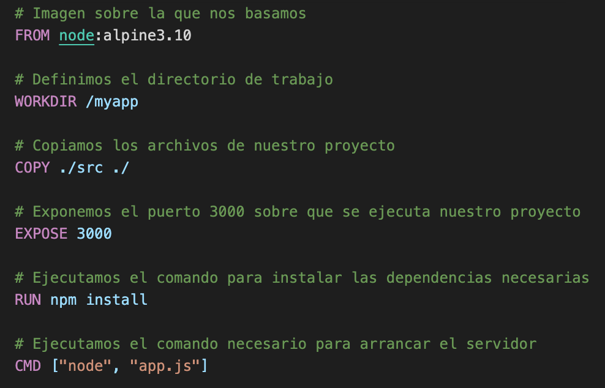

Una vez tenemos definido el Dockerfile, debemos crear el archivo `docker-compose.yaml` sobre el que se levantarán todos nuestros contenedores:

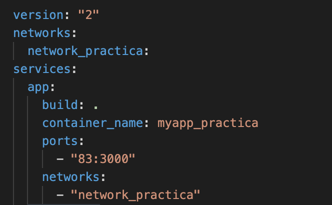

Como podemos observar en la imagen hemos creado una <cite>network</cite> para poder conectar todos nuestros servicios entre sí. Hemos definido nuestro servicio <strong>`app`</strong> donde en el párametro <strong>`build`</strong> le definimos sobre que Dockerfile se debe basar para crear el contenedor. En este caso le decimos que esta en su mismo contexto, para ello, pondremos un <strong>`.`</strong> ; le daremos un nombre al contendor y enlazaremos el puerto 3000 del contenedor con nuestro puerto <stron>`82`</strong> local, y por último le decimos a que network pertenece.

Una vez tenemos definido nuestro nuevo servicio podemos porceder a levantarlo para comprobar su funcionamiento. Para ello debemos ejecutar:

```
docker-compose up --build
```

>El parámetro --build nos permite levantar un contenedor que ha sido creado mediante un Dockerfile.

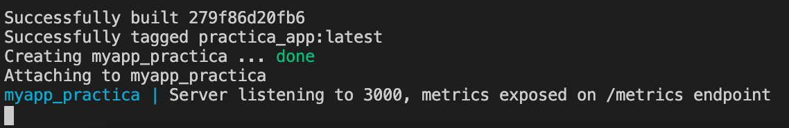

Ahora que ya tenemos el contenedor podemos acceder a <strong>`localhost:83`</strong> y observar que nos muestra el servidor:

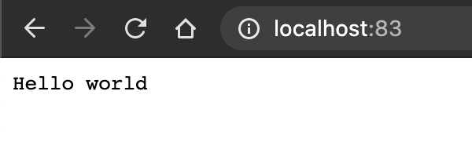

## Prometheus

Prometheus es una aplicación que nos permite recoger métricas de una aplicación en tiempo real. En app.js, se incluye una dependencia en el código (prom-client) que permite crear contadores de peticiones que podemos asociar fácilmente a nuestros endpoints de manera que podemos saber cuántas veces se ha llamado a una función de nuestra api.

Este servicio no necesita de Dockerfile ya que parte de una imagen ya creada en <cite>docker hub</cite>. Para crearlo lo haremos desde el fichero de `docker-compose.yaml`:

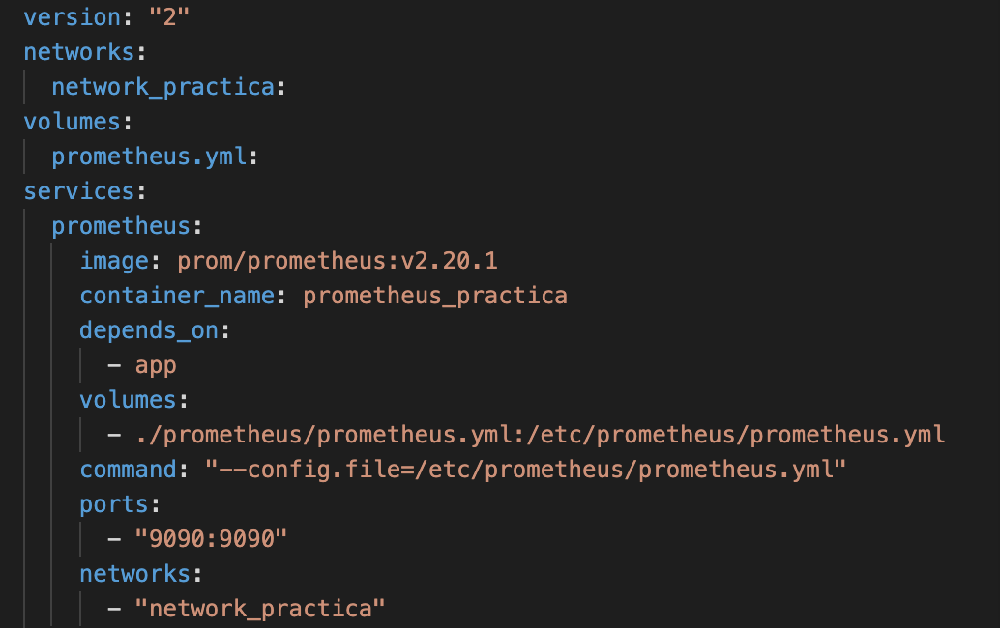

Podemos observar que hemos declarado un nuevo volumen ya que necesitaremos de éste para poder transferir el fichero `prometheus.yml` dentro del contenedor, éste fichero contiene la configuración necesaria para poder conectarlo con nuestro servidor. Se basa en una imagen de prometheus y también le hemos dado un nombre identificativo. En este caso <strong>Prometheus</strong> se nutre de nuestro servidor por ello debemos declarar la opción <strong>`depends_on`</strong> donde le especificamos que depende de nuestro servicio <strong>`app`</strong>. Debemos incluirlo en la misma <strong>`network`</strong> que el servicio de app y en este caso mostrar enlazar los <strong>`ports`</strong> `9090` tanto en local como en en el contenedor. Por último especificamos la opción <strong>`command`</strong> que nos permite ejecutar un comando en el contenedor, en este caso el comando permite aplicar la configuración del fichero:
```
--config.file=/etc/prometheus/prometheus.yml
```

Una vez tenemos el servicio creado y definido ya podemos probar que funciona y que se conecta correctamente con nuestro servidor, ejecutamos:
```
docker-compose up
```

Ahora si accedemos a nuestro <strong>`localhost:9090`</strong> podemos observar que funciona correctamente y que además en el apartado <cite>targets</cite> está enlazado con nuestro servidor

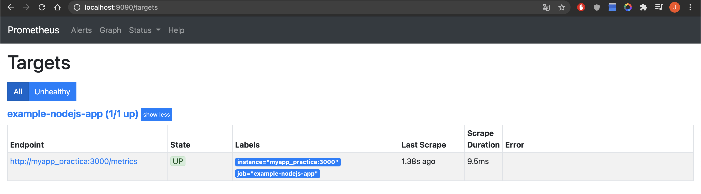

## Grafana

Este servicio será el encargado de graficar todas las métricas creadas por el servicio de Prometheus. 

Como el anterior servicio, éste tampoco necestia de Dockerfile ya que dispone de una imagen propia, entonces lo haremos desde el `docker-compose.yaml`

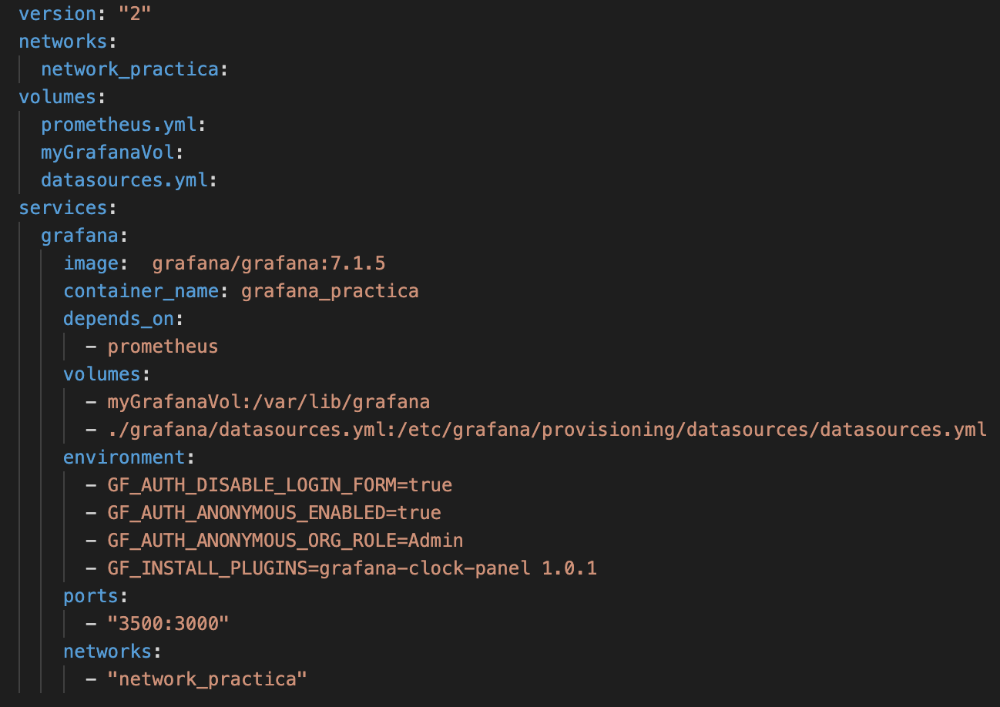

Parte desde una imagen propia y hemos declarado dos nuevos volúmenes para poder guardar la información de grafana (`myGrafanaVol`) y para poder transferir el fichero `datasources.yml` donde se encuentra la configuración para poder conectarse con <strong>Prometheus</strong> y recopilar esas métricas. En este caso el <strong>`depends_on`</strong> hará referencia a <strong>`prometheus`</strong> porque es de quien se nutre. En este contenedor debemos enlazar los <strong>`ports`</strong> `3500 local` con el `3000 del contenedor` para poder acceder. Por supuesto para que puedan verse todos los contenedores debe estar en la misma <strong>`network`</strong> Las variables de entorno son muy importantes ya que nos permitirán:
```
GF_AUTH_DISABLE_LOGIN_FORM=true
```
>Desactivar el inicio de sesión
```
GF_AUTH_ANONYMOUS_ENABLED=true
```
>Que no sea necesario haber iniciado sesión para poder utilizar grafana.
```
GF_AUTH_ANONYMOUS_ORG_ROLE=Admin
```
>Para que ese inicio de sesión anónimo sea de tipo Admin y poder realizar todas las acciones posibles sobre grafana.
```
GF_INSTALL_PLUGINS=grafana-clock-panel 1.0.1
```
>Instalar el plugin del panel de reloj.

Una vez tenemos nuestro servicio preparado ya podemos ejecutar nuestros tres contenedores al mismo tiempo:
```
docker-compose up
```
Ahora si accedemos a <strong>`localhost:3500`</strong> accederemos a <strong>Grafana</strong>.

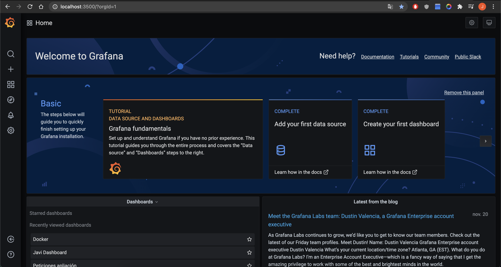

Una vez dentro de <strong>Grafana</strong> podemos acceder a la barra lateral izquierda y crear un nuevo <strong>Dashboard</strong>, en él podemos crear los <strong>Panels</strong> donde se mostrarán los datos y  residirá la lógica.

Para crear el panel gráfico de las peticiones a los endpoints `counterHomeEndpoint` y `counterMessageEndpoint` en la parte inferior del formulario de creación debemos incluir las siguientes <strong>Querys</strong> basándose en las <strong>Metrics</strong> pertinentes sobre el servidor de <strong>Prometheus</strong>

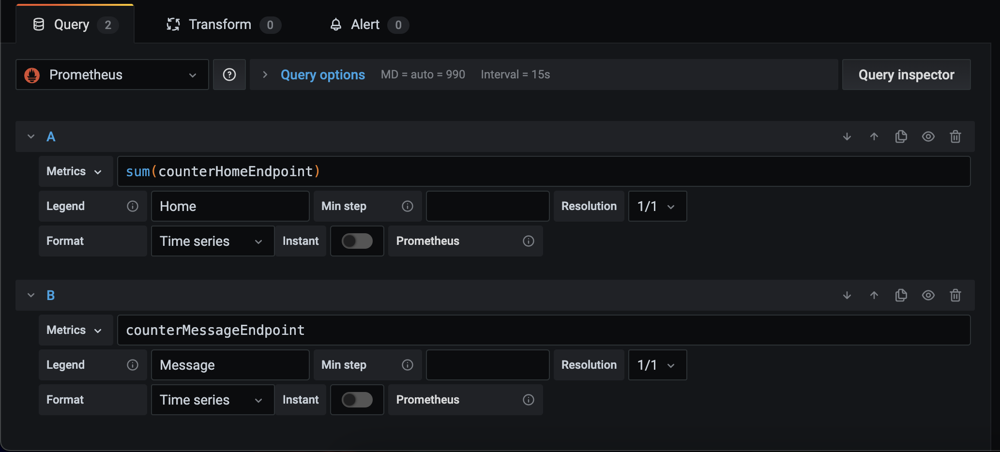

Ahora para crear el segundo panel numérico debemos seleccionar las siguientes opciones en el formulario de creación de paneles:

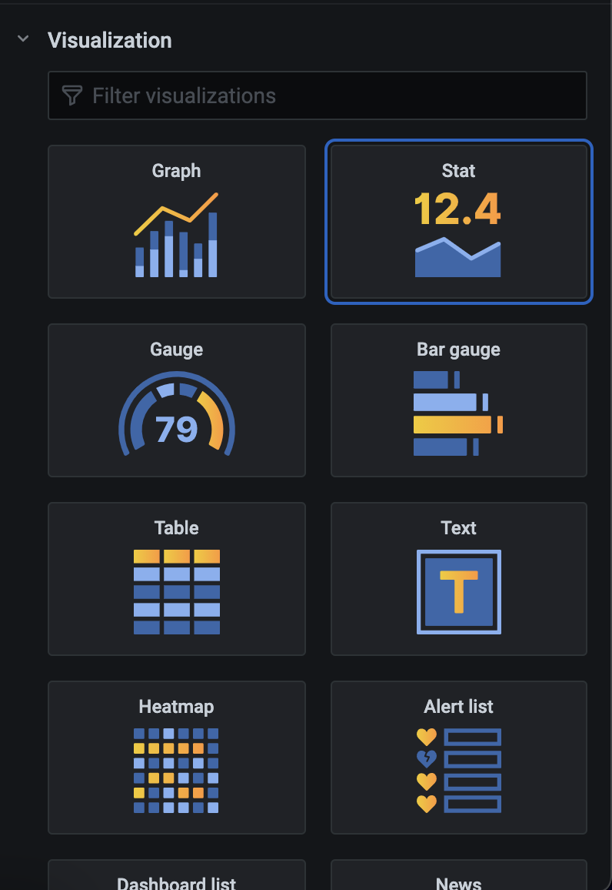

Para que se muestre como un número

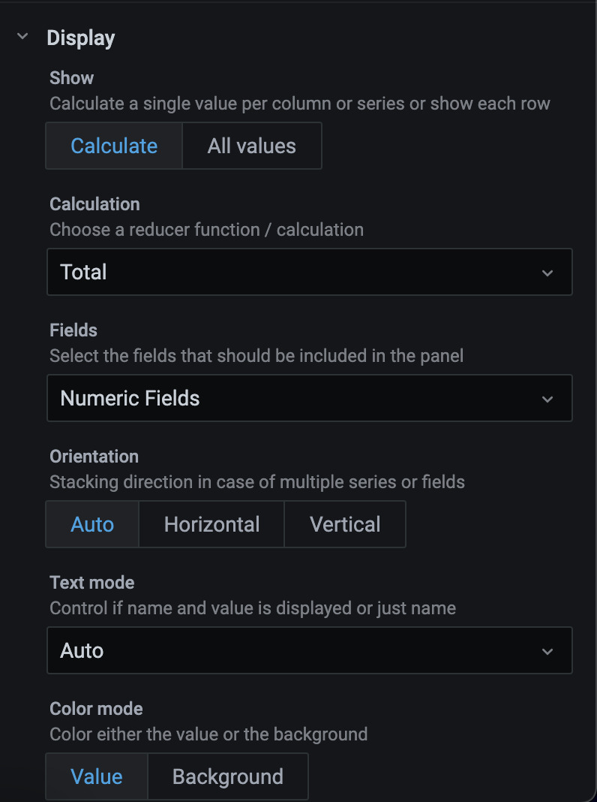

Para que ese número sea el total

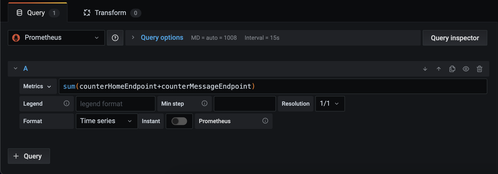

Y la query sobre la que sacamos ese valor, que es la suma de los dos contadores.

Como resultado final podemos observar los dos paneles con el tráfico que están teniendo si realizamos peticiones sobre esos endpoints:

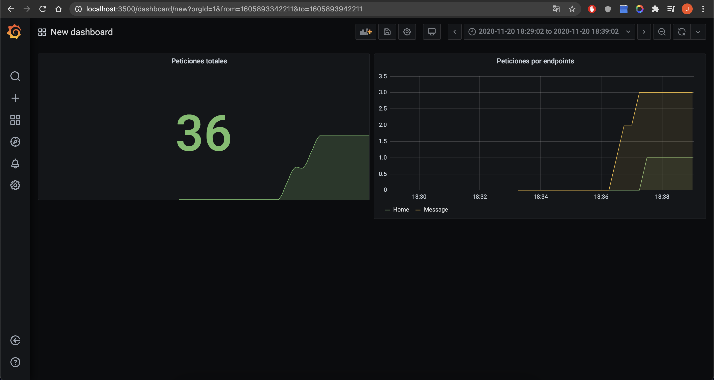

## .dockerignore

Debemos crear un <strong>`.dockerignore`</strong> para que no guarde los `node_modules`, para ello simplemente añadiremos en él:
```
**/node_modules
```

Conclusión
===

En conclusión podemos observar que estós servicios nos ayudarán siempre a estudiar y analizar el comportamiento de nuestras aplicaciones y, por tanto, la posibilidad de mejorarlas o de detectar errores de una manera mucho más sencilla, en mi opinión personal creo que son herramientas muy necesarias para poder llevar a cabo un correcto control sobre el tráfico de nuestra apliación.


